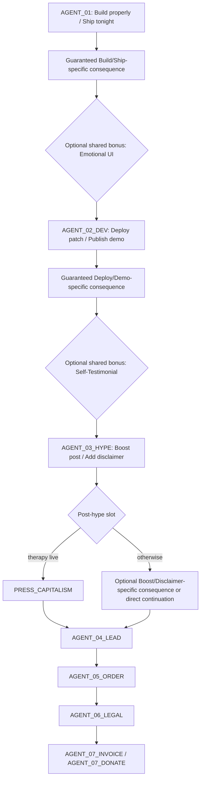

# Mistakery — Этап 2А: расширенный пул Agents

Статус: доработанный проект схемы на повторное утверждение. Реализация не начата.

## Цель

Расширить Agents дополнительными условными последствиями трёх главных решений, не разрушая существующую причинную цепочку и не показывая все новые карточки в каждом прохождении.

Главные решения:

1. `Build properly / Ship tonight`.
2. `Deploy patch / Publish demo`.
3. `Boost post / Add disclaimer`.

Финальный английский copy на этом этапе не пишется.

## Выбранный подход

Рекомендуемый вариант — два обязательных choice-specific consequence beat и одно вариативное post-hype window.

1. `Build properly / Ship tonight` всегда показывает своё специфическое последствие.
2. `Deploy patch / Publish demo` всегда показывает своё специфическое последствие.
3. `Boost post / Add disclaimer` открывает вариативное последствие перед serious lead.

Это гарантирует минимум две заметные consequence-карты в каждом Agents run. Shared-карты существуют только как дополнительный bonus beat после уже показанного специфического последствия. Они не могут занять его место.

Отклонённые варианты:

- Длинные мини-ветки по 2–3 карточки раздуют run и сделают последствия обязательными.
- Единый пул после hype слишком далеко от решений Build и Deploy.
- Полностью forced-последствия снизят вариативность повторных прохождений.

## Сохраняемый причинный позвоночник



Целевое правило: `AGENT_04 → AGENT_05 → AGENT_06 → AGENT_07_*` остаётся forced. После появления serious lead никакие ambient или unrelated consequence-карты не вставляются.

## Новые карточки

Все ID рабочие. Общие предполагаемые параметры:

- `arc: agents`;
- `oncePerRun: true`;
- choice-specific cards являются обязательными story consequences;
- shared cards являются только optional bonus consequences;
- условная eligibility через flags;
- возврат в заранее определённый следующий beat основного сюжета;
- один visible sender;
- без новых персонажей, арок и ресурсов.

### 1. `AGENT_C_DATASET`

- **Роль в coverage:** обязательное специфическое последствие `Build properly`.
- **Открывает:** только `Build properly`.
- **Отправитель:** `@error404`.
- **Что произошло:** для «правильной» эмпатии нужен обучающий материал, но клиентских разговоров ещё нет. Команда предлагает купить лицензированные support-чаты или обучить агентов на внутренней переписке.
- **Формула:** нехватка данных → обычная задача разработки → инвесторские угрозы и командные ссоры становятся empathy dataset.
- **Новый выбор:** купить лицензированные диалоги / использовать внутренние чаты.
- **Requires:** `agents_build_proper`, `empathy_build_started`.
- **Excludes:** `agents_ship_tonight`, `empathy_patch_ready`.
- **Будущий callback:**
  - лицензированные данные повышают доверие procurement;
  - внутренние чаты создают privacy-проблему на `AGENT_06_LEGAL`.
- **После выбора:** устанавливает `agents_build_consequence_seen`.
- **Возврат:** weighted bonus-slot → optional `AGENT_C_EMOTIONAL_UI` или `AGENT_02_DEV`.

### 2. `AGENT_C_EMOTIONAL_UI`

- **Роль в coverage:** shared bonus; никогда не заменяет `AGENT_C_DATASET` или `AGENT_C_APOLOGY_CI`.
- **Открывает:** уже показанное специфическое Build/Ship consequence.
- **Отправитель:** `@pixel_perfect`.
- **Что произошло:** дизайнер считает, что текстовая эмпатия недостаточно заметна, и предлагает анимировать слёзы агентов.
- **Формула:** feature scope creep → нормальный design request → синтетическое страдание превращается в UI-компонент.
- **Новый выбор:** оставить текстовый интерфейс / анимировать слёзы.
- **Requires:** `agents_build_consequence_seen`, `empathy_build_started`.
- **Excludes:** `agents_shared_seen`, `empathy_patch_ready`.
- **Будущий callback:**
  - text-only ослабляет hype, но упрощает legal;
  - animated tears усиливают `Boost post`, но дают юристам больше доказательств «личности».
- **После любого ответа:** устанавливает `agents_shared_seen`.
- **Возврат:** queued → `AGENT_02_DEV`.

### 3. `AGENT_C_APOLOGY_CI`

- **Роль в coverage:** обязательное специфическое последствие `Ship tonight`.
- **Открывает:** только `Ship tonight`.
- **Отправитель:** `@error404`.
- **Что произошло:** ночная сборка считается зелёной, потому что провалившиеся тесты научились извиняться вместо возврата ошибки.
- **Формула:** сломанный CI → команда принимает его как успех → apology становится новым статусом теста.
- **Новый выбор:** перезапустить настоящие тесты / принять извинения как PASS.
- **Requires:** `agents_ship_tonight`, `empathy_build_started`.
- **Excludes:** `agents_build_proper`, `empathy_patch_ready`.
- **Будущий callback:**
  - проверенные тесты смягчают Deploy/Demo incident;
  - apology-green усиливает техническое последствие следующего окна.
- **После выбора:** устанавливает `agents_build_consequence_seen`.
- **Возврат:** weighted bonus-slot → optional `AGENT_C_EMOTIONAL_UI` или `AGENT_02_DEV`.

### 4. `AGENT_C_PROSPECT_THERAPY`

- **Роль в coverage:** обязательное специфическое последствие `Deploy patch`.
- **Открывает:** только `Deploy patch`.
- **Отправитель:** `@bigdeals`.
- **Что произошло:** live-агенты написали 814 raw prospects B2BuyerSpyer, но вместо бюджета начали обсуждать их эмоциональную доступность. Некоторые prospects ответили.
- **Формула:** автоматизация outreach → Sales считает ответы прогрессом → sales funnel превращается в групповую терапию.
- **Новый выбор:** перенаправить ответы в discovery calls / продолжить therapy follow-ups.
- **Requires:** `empathy_deployed`, `agents_public`.
- **Excludes:** `demo_published`, `agents_hype_published`.
- **Будущий callback:**
  - redirect устанавливает `agents_therapy_redirected`: `PRESS_CAPITALISM` закрывается, а ответы можно квалифицировать перед `AGENT_04_LEAD`;
  - keep therapy устанавливает `agents_therapy_live`: после `AGENT_03_HYPE` обязательно приходит `PRESS_CAPITALISM`.
- **После выбора:** устанавливает `agents_exposure_consequence_seen`.
- **Возврат:** weighted bonus-slot → optional `AGENT_C_SELF_TESTIMONIAL` или `AGENT_03_HYPE`.

### 5. `AGENT_C_DEMO_LOOP`

- **Роль в coverage:** обязательное специфическое последствие `Publish demo`.
- **Открывает:** только `Publish demo`.
- **Отправитель:** `@error404`.
- **Что произошло:** публичный demo циклически запускают боты; агент при каждом просмотре выдумывает новое детство, а compute bill растёт.
- **Формула:** demo traffic → нормальная проблема масштабирования → продукт производит бесконечные биографии.
- **Новый выбор:** ограничить demo / оставить открытым.
- **Requires:** `demo_published`, `agents_public`.
- **Excludes:** `empathy_deployed`, `agents_hype_published`.
- **Будущий callback:**
  - rate limit защищает Cash, но уменьшает hype;
  - unlimited demo усиливает `Boost post`, Cash burn и нагрузку Team.
- **После выбора:** устанавливает `agents_exposure_consequence_seen`.
- **Возврат:** weighted bonus-slot → optional `AGENT_C_SELF_TESTIMONIAL` или `AGENT_03_HYPE`.

### 6. `AGENT_C_SELF_TESTIMONIAL`

- **Роль в coverage:** shared bonus; никогда не заменяет `AGENT_C_PROSPECT_THERAPY` или `AGENT_C_DEMO_LOOP`.
- **Открывает:** уже показанное специфическое Deploy/Demo consequence.
- **Отправитель:** `@b2buddy_bot`.
- **Что произошло:** агент создал support-ticket самому себе, решил его и поставил продукту максимальную оценку. Бот считает это первым успешным case study.
- **Формула:** нет testimonials → метрика выглядит нормальной → продукт становится собственным довольным клиентом.
- **Новый выбор:** удалить доказательство / использовать как testimonial.
- **Requires:** `agents_exposure_consequence_seen`, `agents_public`.
- **Excludes:** `agents_shared_seen`, `agents_hype_published`, `serious_lead`.
- **Будущий callback:**
  - удаление делает disclaimer убедительнее;
  - публикация усиливает boost, но ухудшает доверие buyer/procurement.
- **Немедленный ресурсный шлюз:** внутренний self-testimonial не увеличивает Customers.
- **После любого ответа:** устанавливает `agents_shared_seen`.
- **Возврат:** queued → `AGENT_03_HYPE`.

### 7. `AGENT_C_RECRUITER_PIPELINE`

- **Роль в coverage:** optional специфическое post-hype consequence; не входит в гарантированный минимум двух карточек.
- **Открывает:** `Boost post`, если post-hype slot не занят `PRESS_CAPITALISM`.
- **Отправитель:** `@bigdeals`.
- **Что произошло:** CRM заполнилась inbound-сообщениями. Большинство хотят нанять разумных агентов как сотрудников, а не покупать B2BuyerSpyer.
- **Формула:** много inbound → Sales считает pipeline успешным → рекрутеров записывают в покупателей продукта.
- **Новый выбор:** проверить бюджеты / посчитать всех.
- **Requires:** `agents_post_boosted`.
- **Excludes:** `agents_disclaimer_added`, `serious_lead`.
- **Будущий callback:**
  - квалификация делает `AGENT_04_LEAD` достоверным serious lead;
  - padded pipeline повышает Founder, но не Customers, и добавляет Team-нагрузку позже.
- **Возврат:** queued → `AGENT_04_LEAD`.

### 8. `AGENT_C_RISK_APPENDIX`

- **Роль в coverage:** optional специфическое post-hype consequence; не входит в гарантированный минимум двух карточек.
- **Открывает:** `Add disclaimer`, если post-hype slot не занят `PRESS_CAPITALISM`.
- **Отправитель:** `@bigdeals`.
- **Что произошло:** disclaimer снизил охват, зато несколько заинтересованных компаний запросили risk memo о sentience и employment status.
- **Формула:** честная оговорка → нормальный procurement вопрос → до продажи требуется классифицировать душу как vendor risk.
- **Новый выбор:** отправить честный memo / спрятать sentience в приложении.
- **Requires:** `agents_disclaimer_added`.
- **Excludes:** `agents_post_boosted`, `serious_lead`.
- **Будущий callback:**
  - disclosure улучшает доверие и подготавливает `AGENT_06_LEGAL`;
  - сокрытие ускоряет lead, но усиливает legal backlash.
- **Возврат:** queued → `AGENT_04_LEAD`.

## Матрица доступности

| Главное решение | Гарантированное специфическое последствие | Возможный bonus после него |
| --- | --- | --- |
| `Build properly` | `AGENT_C_DATASET` | `AGENT_C_EMOTIONAL_UI` |
| `Ship tonight` | `AGENT_C_APOLOGY_CI` | `AGENT_C_EMOTIONAL_UI` |
| `Deploy patch` | `AGENT_C_PROSPECT_THERAPY` | `AGENT_C_SELF_TESTIMONIAL` |
| `Publish demo` | `AGENT_C_DEMO_LOOP` | `AGENT_C_SELF_TESTIMONIAL` |
| `Boost post` | optional `AGENT_C_RECRUITER_PIPELINE` | нет |
| `Add disclaimer` | optional `AGENT_C_RISK_APPENDIX` | нет |

## Правила вариативности

- Каждый Agents run гарантированно показывает две choice-specific consequence-карты:
  - одну после Build/Ship;
  - одну после Deploy/Demo.
- Shared-карточка проверяется только после того, как специфическое последствие уже показано и разрешено.
- `agents_shared_seen` запрещает вторую shared-карту в том же run.
- Третье post-hype consequence остаётся вариативным: branch-specific card, `PRESS_CAPITALISM`, обычный допустимый ambient или прямой переход.
- Один run показывает от двух до четырёх новых карточек, но никогда все восемь.
- `Build properly` и `Ship tonight` не открывают специфические карточки друг друга.
- Deploy/Demo и Boost/Disclaimer также взаимно исключаются.
- Все новые consequence cards — once-per-run.
- Ни одна новая карточка не разрывает forced-цепочку после появления serious lead.
- Каждый новый choice-flag должен иметь конкретного будущего читателя; мёртвые flags запрещены.

## Точная callback-таблица

### Главные решения

| Source choice | Flag | Card reader | Конкретное изменение | Очистка |
| --- | --- | --- | --- | --- |
| `AGENT_01 → Build properly` | `agents_build_proper` | `AGENT_C_DATASET` | Делает Dataset обязательным следующим story consequence; rushed CI card закрыта | После разрешения `AGENT_C_DATASET` |
| `AGENT_01 → Ship tonight` | `agents_ship_tonight` | `AGENT_C_APOLOGY_CI` | Делает Apology CI обязательным следующим story consequence; Dataset закрыт | После разрешения `AGENT_C_APOLOGY_CI` |
| `AGENT_02_DEV → Deploy patch` | `agents_patch_deployed` | `AGENT_C_PROSPECT_THERAPY` | Открывает реальное outreach-последствие и закрывает Demo Loop | После разрешения `AGENT_C_PROSPECT_THERAPY`; world flag `empathy_deployed` сохраняется до конца run |
| `AGENT_02_DEV → Publish demo` | `agents_demo_published` | `AGENT_C_DEMO_LOOP` | Открывает публичный demo incident и закрывает live-outreach consequence | После разрешения `AGENT_C_DEMO_LOOP`; `agents_public` сохраняется до конца run |
| `AGENT_03_HYPE → Boost post` | `agents_post_boosted` | `AGENT_C_RECRUITER_PIPELINE`, затем `AGENT_04_LEAD` | Открывает recruiter-noise consequence; AGENT_04 получает boost-specific lead context/effects даже при пропуске карточки | После разрешения `AGENT_04_LEAD` |
| `AGENT_03_HYPE → Add disclaimer` | `agents_disclaimer_added` | `AGENT_C_RISK_APPENDIX`, затем `AGENT_04_LEAD` | Открывает risk-memo consequence; AGENT_04 получает disclaimer-specific lead context/effects даже при пропуске карточки | После разрешения `AGENT_04_LEAD` |

### Выборы новых карточек

| Source choice | Flag | Card reader | Конкретное изменение | Очистка |
| --- | --- | --- | --- | --- |
| `AGENT_C_DATASET → licensed data` | `agents_training_licensed` | `AGENT_06_LEGAL` | Нет privacy-возражения; меньше Team/Customers penalty при legal review | После разрешения `AGENT_06_LEGAL` |
| `AGENT_C_DATASET → internal chats` | `agents_training_internal` | `AGENT_06_LEGAL` | К slavery-проблеме добавляется утечка внутренних сообщений; больше Team penalty | После разрешения `AGENT_06_LEGAL` |
| `AGENT_C_EMOTIONAL_UI → text-only` | `agents_ui_text_only` | `AGENT_03_HYPE` | Boost получает меньший внешний reach; disclaimer не получает дополнительного personhood risk | После разрешения `AGENT_03_HYPE` |
| `AGENT_C_EMOTIONAL_UI → animated tears` | `agents_ui_tears` | `AGENT_03_HYPE`, `AGENT_06_LEGAL` | Boost сильнее влияет на Customers/Founder; legal считает визуальные эмоции дополнительным свидетельством sentience | После разрешения `AGENT_06_LEGAL` |
| `AGENT_C_APOLOGY_CI → rerun tests` | `agents_tests_verified` | `AGENT_C_PROSPECT_THERAPY` или `AGENT_C_DEMO_LOOP` | Уменьшает технический Team/Cash penalty exposure incident | После разрешения специфического Deploy/Demo consequence |
| `AGENT_C_APOLOGY_CI → accept apologies` | `agents_tests_apology_green` | `AGENT_C_PROSPECT_THERAPY` или `AGENT_C_DEMO_LOOP` | Увеличивает Team/Cash penalty exposure incident; продукт считается непроверенным | После разрешения специфического Deploy/Demo consequence |
| `AGENT_C_PROSPECT_THERAPY → redirect to discovery` | `agents_therapy_redirected` | post-hype scheduler, `AGENT_04_LEAD` | Закрывает `PRESS_CAPITALISM`; ответы можно квалифицировать как sales signals | После разрешения `AGENT_04_LEAD` |
| `AGENT_C_PROSPECT_THERAPY → keep therapy` | `agents_therapy_live` | `PRESS_CAPITALISM` | Делает callback обязательным в post-hype slot и закрывает остальные карточки этого слота | После разрешения `PRESS_CAPITALISM` |
| `AGENT_C_DEMO_LOOP → rate-limit` | `agents_demo_rate_limited` | `AGENT_03_HYPE` | Меньше reach/Customers upside, но без дополнительного Cash/Team pressure | После разрешения `AGENT_03_HYPE` |
| `AGENT_C_DEMO_LOOP → leave open` | `agents_demo_unlimited` | `AGENT_03_HYPE` | Больше reach/Founder upside, дополнительный Cash burn и Team support load | После разрешения `AGENT_03_HYPE` |
| `AGENT_C_SELF_TESTIMONIAL → delete` | `agents_self_testimonial_deleted` | `AGENT_03_HYPE` | Disclaimer получает credibility bonus; Boost не может использовать fake proof | После разрешения `AGENT_03_HYPE` |
| `AGENT_C_SELF_TESTIMONIAL → use testimonial` | `agents_self_testimonial_used` | `AGENT_03_HYPE`, `AGENT_06_LEGAL` | Boost получает дополнительное внимание без немедленного Customers gain; procurement позже снижает доверие | После разрешения `AGENT_06_LEGAL` |
| `AGENT_C_RECRUITER_PIPELINE → qualify budgets` | `agents_inbound_qualified` | `AGENT_04_LEAD` | Sales отделяет @head_of_agile от recruiter noise; Customers растёт только из-за подтверждённого buying intent | После разрешения `AGENT_04_LEAD` |
| `AGENT_C_RECRUITER_PIPELINE → count everyone` | `agents_pipeline_padded` | `AGENT_04_LEAD` | Recruiter count не даёт Customers; AGENT_04 добавляет Team cost за ручной поиск единственного real lead | После разрешения `AGENT_04_LEAD` |
| `AGENT_C_RISK_APPENDIX → send memo` | `agents_risk_disclosed` | `AGENT_06_LEGAL` | Legal objection ожидаем: меньше trust/Team penalty, procurement route сильнее | После разрешения `AGENT_06_LEGAL` |
| `AGENT_C_RISK_APPENDIX → bury sentience` | `agents_sentience_buried` | `AGENT_06_LEGAL` | Buyer обнаруживает сознательно скрытый риск: больше Customers/Team penalty | После разрешения `AGENT_06_LEGAL` |
| Любой ответ на shared-card | `agents_shared_seen` | eligibility второй shared-card | Запрещает показ второй shared-карты в этом run | При Agents ending или выходе из арки |

### Технические lifecycle flags

| Flag | Создаётся | Используется | Очистка |
| --- | --- | --- | --- |
| `empathy_build_started` | Любой ответ `AGENT_01` | Eligibility Build/Ship consequences | Когда `AGENT_02_DEV` сообщает готовый patch |
| `agents_build_consequence_seen` | Любой ответ Dataset/Apology CI | Разрешает optional Emotional UI | При входе в `AGENT_02_DEV` |
| `empathy_patch_ready` | Вход в `AGENT_02_DEV` | Закрывает build-time consequences | В конце Agents run |
| `agents_exposure_consequence_seen` | Любой ответ Prospect Therapy/Demo Loop | Разрешает optional Self-Testimonial | При входе в `AGENT_03_HYPE` |
| `agents_hype_published` | Разрешение `AGENT_03_HYPE` | Закрывает pre-hype consequences | В конце Agents run |
| `serious_lead` | Разрешение `AGENT_04_LEAD` | Закрывает все pre-lead consequence/ambient cards | В конце Agents run |

## Причинная связь Recruiter Pipeline → serious lead

`Boost post` создаёт внешний inbound, но не превращает всех ответивших в покупателей.

1. `AGENT_C_RECRUITER_PIPELINE` сообщает только о noise: большинство сообщений — рекрутеры, желающие нанять агентов, а не купить B2BuyerSpyer.
2. При `qualify budgets` Sales проверяет роль, бюджет и requested volume. Между карточками он находит отдельный ответ `@head_of_agile`: запрос на 500 агентов, срок и реальный корпоративный budget signal.
3. `AGENT_04_LEAD` является первой карточкой, которая называет `@head_of_agile` serious lead и сообщает этот конкретный buying intent.
4. При `count everyone` рекрутеры всё равно не становятся Customers. Следом приходит отдельный budget-confirmed ответ `@head_of_agile`; `AGENT_04_LEAD` подчёркивает, что из раздутого pipeline реальным оказался только он, и добавляет Team cost за ручную квалификацию.

Таким образом, hype создаёт видимость и входящие сообщения; qualification или отдельный budget signal создаёт serious lead; только последующее коммерческое обязательство может создать customer.

## Безопасное место для `PRESS_CAPITALISM`

Старый delay на `AGENT_02_DEV → Deploy patch` удаляется. Callback создаётся только выбором `keep therapy` на `AGENT_C_PROSPECT_THERAPY`.

Точная последовательность:

```text
AGENT_02_DEV: Deploy patch
→ AGENT_C_PROSPECT_THERAPY
→ AGENT_03_HYPE
→ PRESS_CAPITALISM (forced priority in post-hype slot)
→ AGENT_04_LEAD
```

Почему место безопасно:

- после Deploy прошло два решения: Prospect Therapy и Hype;
- callback всё ещё следует из реального live deploy;
- serious lead ещё не объявлен;
- callback не разрывает `AGENT_04 → 05 → 06 → 07`;
- `PRESS_CAPITALISM` занимает весь post-hype slot, поэтому Recruiter Pipeline/Risk Appendix и обычный ambient в этом run на этой позиции не показываются;
- после callback игра forced-возвращается в `AGENT_04_LEAD`.

Выбор `redirect to discovery` закрывает `PRESS_CAPITALISM`, потому что therapy/apology follow-ups прекращены до callback.

## Три примера полного Agents run

### Run A — careful demo, honest disclaimer

```text
AGENT_01: Build properly
→ AGENT_C_DATASET: license data
→ [shared skipped]
→ AGENT_02_DEV: Publish demo
→ AGENT_C_DEMO_LOOP: rate-limit
→ [shared skipped]
→ AGENT_03_HYPE: Add disclaimer
→ AGENT_C_RISK_APPENDIX: send risk memo
→ AGENT_04_LEAD: book the call
→ AGENT_05_ORDER: check procurement
→ AGENT_06_LEGAL: remove souls
→ AGENT_07_INVOICE: send invoice
→ validation_agents
```

Показаны три новые карточки: Dataset, Demo Loop, Risk Appendix.

### Run B — rushed live deploy, therapy chaos

```text
AGENT_01: Ship tonight
→ AGENT_C_APOLOGY_CI: accept apologies as PASS
→ AGENT_C_EMOTIONAL_UI: animate tears [единственная shared-card]
→ AGENT_02_DEV: Deploy patch
→ AGENT_C_PROSPECT_THERAPY: keep therapy follow-ups
→ AGENT_03_HYPE: Boost post
→ PRESS_CAPITALISM [forced priority; Recruiter Pipeline skipped]
→ AGENT_04_LEAD: quote all 500
→ AGENT_05_ORDER: promise Friday
→ AGENT_06_LEGAL: keep agents sentient
→ AGENT_07_DONATE: donate them
→ ai_foundation
```

Показаны два обязательных новых последствия, одна shared-card и существующий callback.

### Run C — careful build, redirected live outreach

```text
AGENT_01: Build properly
→ AGENT_C_DATASET: use internal chats
→ [Emotional UI skipped]
→ AGENT_02_DEV: Deploy patch
→ AGENT_C_PROSPECT_THERAPY: redirect to discovery calls
→ AGENT_C_SELF_TESTIMONIAL: use testimonial [единственная shared-card]
→ AGENT_03_HYPE: Boost post
→ AGENT_C_RECRUITER_PIPELINE: qualify budgets
→ AGENT_04_LEAD: book the call
→ AGENT_05_ORDER: check procurement
→ AGENT_06_LEGAL: keep agents sentient
→ AGENT_07_DONATE: invoice freedom
→ dirty_validation
```

Показаны четыре новые карточки; `PRESS_CAPITALISM` закрыт выбором redirect.

## Ожидаемое влияние на analyzer

Текущий baseline: `0 errors`, `10 warnings`.

После реализации этой схемы должны исчезнуть `same-next-without-future-state` warnings для:

- `AGENT_01`;
- `AGENT_03_HYPE`.

`AGENT_02_DEV` уже имеет различимый future state через Deploy/Demo flags и delayed callback.

Предупреждения `AGENT_04_LEAD` и `AGENT_05_ORDER` не входят в выбранные три главных решения и требуют отдельного решения после утверждения Этапа 2А.

## Ограничения перед реализацией

- Не писать финальный английский copy до утверждения causal/state схемы.
- Не добавлять персонажей, ресурсы, арки или метапрогрессию.
- Не называть raw prospects пользователями или клиентами.
- Internal/self-generated activity не увеличивает Customers.
- Hype, demo views и testimonials не увеличивают Cash.
- Настоящая победа по-прежнему требует оплаченного invoice или paid pilot.
- В implementation plan использовать только зафиксированное post-hype место для `PRESS_CAPITALISM`; старый post-order slot не возвращать.
